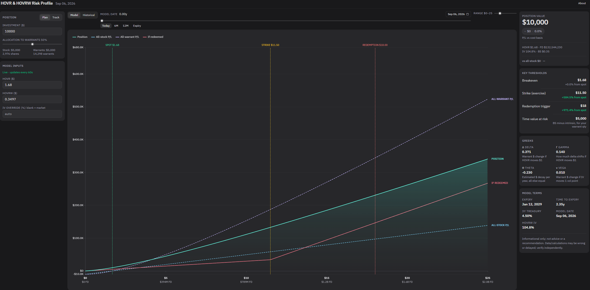
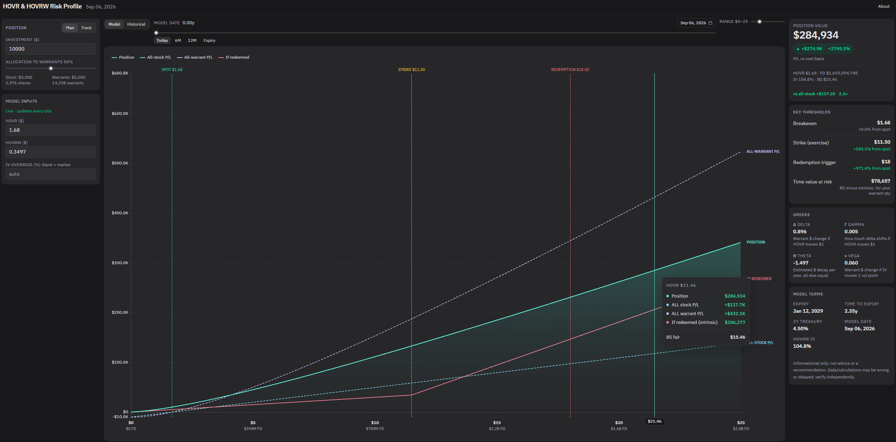
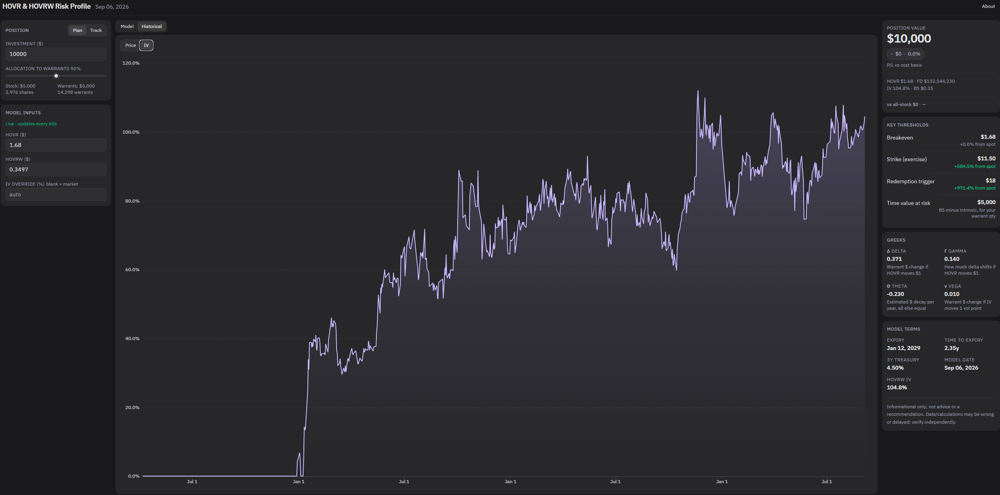

# HOVR & HOVRW Risk Profile

A single-page warrant payoff analyzer for Horizon Aircraft (`HOVR` / `HOVRW`). It prices the warrant with Black-Scholes, lets you plan or track a mixed stock+warrant book, and compares that book to all-stock, all-warrant, and forced-redemption outcomes.

**Live app:** [hovr-warrant-price-calculator.vercel.app](https://hovr-warrant-price-calculator.vercel.app/)


Informational only — not advice. Data may be delayed or wrong. Verify independently.

## Screenshots

**Model payoff** — position vs all-stock, all-warrant, and if-redeemed, with spot / strike / redemption marks.



**Hover / pin** — metrics, Greeks, and TVaR follow the cursor along the curve.



**Historical IV** — implied vol solved each day from HOVR and HOVRW closes.



## What it does

- **Model** — payoff chart (position, all-stock, all-warrant, if-redeemed), Greeks, breakeven / strike / redemption, IV solved from the live warrant price.
- **Historical** — daily HOVR and HOVRW closes and implied vol (`solveIV` per day).
- **Live prices** — Finnhub last print, polled about every 60 seconds (server + browser).

## Stack

| Layer | What |
|---|---|
| UI | React, TypeScript, Vite, Tailwind v4, Apache ECharts |
| API | Express, `tsx` |
| Live quotes | Finnhub REST `/quote` (token on the server only) |
| History (local) | CSV daily closes in `server/data/` |
| History (production) | Postgres (Neon) — same append-after-close rules |

```
Sheets seed (already in repo)
        │
        ▼
server/data/*.csv  ──read──►  GET /api/history  ──►  Historical chart
        ▲
        │ append after NY close
Finnhub /quote  ──60s──►  liveCache  ──►  GET /api/current  ──►  Model Inputs
```

Vite proxies `/api` to `http://localhost:3001` so the browser only talks to port 5173.

## Local setup

You need Node 18+ and a [Finnhub](https://finnhub.io/) API token.

```bash
git clone https://github.com/Anton-Ngan/hovr-warrant-price-calculator.git
cd hovr-warrant-price-calculator
```

**Server**

```bash
cd server
cp .env.example .env
# put your token in .env:
#   PORT=3001
#   FINNHUB_TOKEN=your_token
npm install
npm run dev
```

**Frontend** (second terminal)

```bash
cd frontend
npm install
npm run dev
```

Open the URL Vite prints (usually `http://localhost:5173`). Keep both processes running. If the server is down, Model Inputs show “Live prices unavailable” and Historical shows a load error.

```bash
cd frontend && npm run test
```

## History files

`server/data/hovr_daily_closing_price.csv` and `hovrw_daily_closing_price.csv` are the local ledger (Sheets seed from April 2023, then after-close Finnhub appends). Do not commit `.env`. Do not put the Finnhub token in the frontend.

## Disclaimer

This is a model, not the market. Black-Scholes treats the warrant as a European call; redemption mechanics are simplified. Historical IV uses today’s strike and expiry on every past day.
